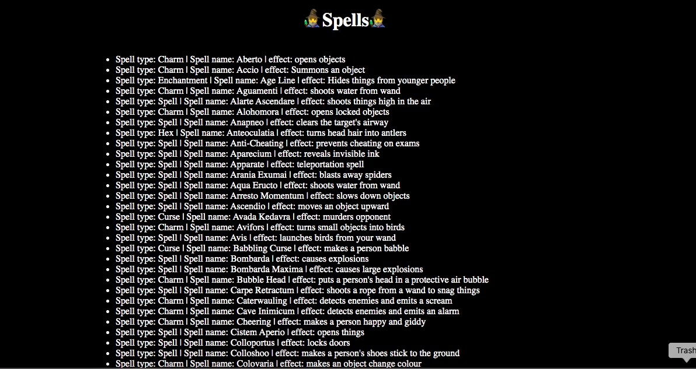
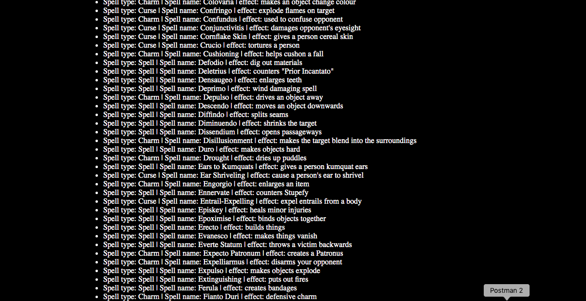

##  Spells from the Harry Potter series

* Testing the Harry Potter API, this uses the /spells route to display a list of all of the spells from the Harry Potter series, on the page.

* NB - I signed up for an api key, which was used to access the data, but have not included it in the code that has been pushed, instead replacing the real key with :  'fakekey'.
* Hence, I have not included instructions on how to use this.

### Built with

* JavaScript
* HTML/CSS
* Harry Potter API

### What it looks like

